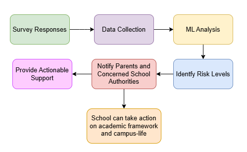

WellNest
---
**An integrated AI-driven solution to manage student mental healthcare with a focus on privacy**

## Brief Intro
Mental health is a critical concern for students, yet it often goes unnoticed until it manifests as a crisis. WellNest aims to bridge this gap by proactively identifying mental health concerns through regular surveys, analyzing the data using machine learning, and collaborating with mental health professionals to offer personalized solutions. With a focus on anonymity and encryption, WellNest ensures students feel safe and supported.

## Workflow Diagram

## Concept Map
<!-- Rephrase Survey module, destroy User Interface, rephrase User Interface(add general survey metrix and option to interact with counsellors) -->
1. **Survey Module**: Collects data from students via privacy-focused surveys by implementing AES encryption. 
2. **Analysis Engine**: A machine learning model processes survey data to identify patterns and risk levels.
3. **Action Module**: Flags high-risk cases and informs parents/guardians as well as concerned school authorities to prevent further escalation.
4. **User Interface**: Provides students with actionable resources and anonymous spaces for peer interaction.
5. **Security and Privacy**: Implements encryption to protect user data and ensure anonymity.

## Tech Stack
<!-- add googapi calendar/meet/gmail, include kaggle datasets links later, possible add use of each tool  -->
- Flask
- SQLAlchemy
- Google API (Integration with Google Calendar and Meet)
- WTForms
- Matplotlib/Seaborn
- Scikit-learn
- Kaggle datasets

## Novelty
<!-- add free sessions as a novelty -->
1. **Anonymity**: Unlike existing platforms such as BetterHelp, WellNest ensures user anonymity in public and private interactions.
2. **Proactive Support**: By analyzing surveys with machine learning, WellNest identifies potential risks before they escalate.
3. **Encryption-First Approach**: Prioritizing data security to build trust among students.
4. **Collaboration with Professionals**: Integrating expert opinions into automated workflows for better outcomes.

## Solution
WellNest simplifies mental health monitoring and action through the following steps:

1. Students fill out quick, anonymous surveys.
2. Machine learning algorithms analyze responses to identify potential risks.
3. High-risk cases are flagged for mental health professionals, ensuring timely intervention.
4. Students are provided with actionable resources tailored to their specific needs.

## Others
**Target Audience**: Students in academic institutions who require mental health support.

**Future Scope**: Expanding Expanding WellNest to corporate environments, integrating wearable device data, and offering multilingual support.

### Team members
1. Tanish Desai
2. Abhyuday Vaish
3. Siddharth Nevgi
4. Anshu Yadav